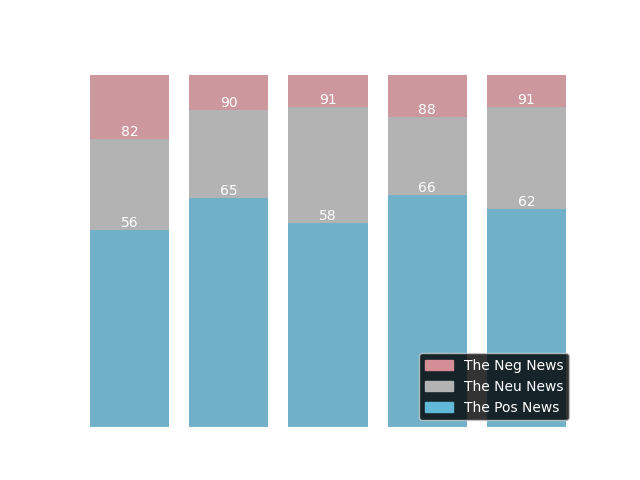
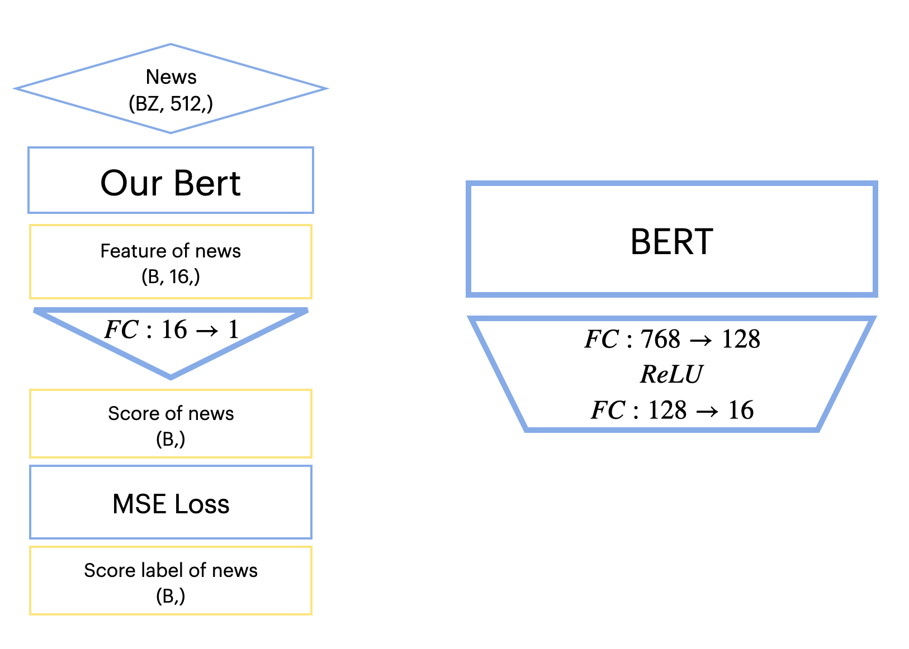

# Stock Price Prediction

# Contents

- [Stock Price Prediction](#stock-price-prediction)
- [Contents](#contents)
- [About](#about)
- [Set up environment](#set-up-environment)
- [Prepare Data](#prepare-data)
  - [Raw Data](#raw-data)
  - [Training Data](#training-data)
- [Visualize Data](#visualize-data)
- [Fine Tune BERT](#fine-tune-bert)
- [Go Predict](#go-predict)
- [Experiment](#experiment)
- [Acknowledgement](#acknowledgement)

# About

This is a side project create by Lucy's and me, the main idea is use Bert model for fuse the stock news title and past stock price to predict the stock price in the future.

What we notice when investing in stocks is that in addition to observing the past values of stocks and short-term changes in stocks. We also refer to the news of the stock market, that is, we refer to the buying and selling conditions of other investors or the operating conditions of the company. This is why simple models such as LSTM or DNN will be inaccurate in stock forecasting - it loses the fundamental value of the stock.

Therefore, we hope to use bert to identify the positive or negative impact of news on stocks, that is, to use bert to solve downstream tasks. However, we are faced with a huge problem, we only have historical daily stock prices, not hourly or even minutely stock data. And representing dozens of news, their answers during training will be the same (news published within the same day).
So we thought of another method: According to the free or fetching news API on the Internet, we can get the value of each news, and use this value as the ground truth of fine-tune. In inference, the average score of all news of the day is predicted as the predicted stock market rise.

<!-- 
# Report

You can find the report in this table.

|      | HW1                              | HW2                  | HW3 | HW4 | HW5 |
| ---- | -------------------------------- | -------------------- | --- | --- | --- |
| Link | [PDF](./HWreport/HW1_109511068.pdf) | [MD](./HWreport/hw2.md) |     |     |     | -->

# Set up environment

```bash
$git clone git@github.com:henrytsui000/DataScienceProject.git
$cd $(THIS_PROJECT)
$conda create -n IDS python=3.8
$conda activate IDS
$pip install -r requirements.txt
# install pytorch, please choose your cuda version
$conda install pytorch torchvision torchaudio pytorch-cuda=11.6 -c pytorch -c nvidia
```

# Prepare Data

## Raw Data

There are two ways to get the news data and the stock price data:

1. Run the python code to get the data. You may apply an account at marketaux, and add an .env file which indicate the TOKEN

```bash
$python tools/update_data.py
$python tools/update_news.py
```

2. Use the command below to download the files which I upload to the Google Drive.

```bash
$gdown --folder https://drive.google.com/drive/folders/1WR5bq9gzMtNFHMnTB6dLEm8AeJj8b9ZT?usp=share_link
```

The file structure you downloaded is as follows:

```
./data
├── news.csv
└── stock.csv 

0 directories, 2 files
```

## Training Data

This step for transform data in news and stock to format data, easier for model reading.

```bash
$python tools/make_bert.py
$python make_regression.py
```

# Visualize Data

Before we train the model, we do explore data analysis. There are some example figure below, and you can find the more detail at here. [**More Detail**](visulize/README.md)

| Correlation GIF | News | Stock Risk |
|-|-|-|
||||

# Go Predict

We attempt to use BERT's powerful language processing capabilities to increase our ability to understand the stock market to help us predict stocks. Perhaps this cannot allow us to accurately forecast stocks forever, after all, the stock market is affected by both market trading and company conditions. But we want to be able to maximize the mastery of the latter. Rather than other models blindly learning relationships between numbers that don't exist.

## Data problems

Then we ran into a big problem, with dozens or even hundreds of news items every day. It is irrational to use the gap between stock prices in two days as ground truth, because such good news may be defined as ordinary news.

Therefore, we thought of a superb solution - we will get the evaluation of the news through the API through the official news. We first use BERT to add a simple MLP to predict the news evaluation.

But it is a bit unrealistic to take the average score of each news to the final stock price forecast. What I mean is that too much news information into a single number will blur the forecast results.

## Solutions!

Therefore, in the actual prediction, we remove the MLP and regard the BERT output as the feature of the news. Input into the designed model to make predictions.


## Fine Tune BERT

### Architecture

As mentioned in the above paragraph, our bert model is shown below. First, there will be pre-trained bert (it is conceivable that we do not have enough data to do bert pre-training). Then, after the MLP constructed by myself, it is separated into feature and output, and the value obtained by output and news API is used as ground truth, and MSE loss is used for training. See **[experiment](#experiment)** for detailed training status.


### Train the BERT

It takes about an hour to train Bert from scratch (single RTX3090).
If the RAM is not large enough or you don’t want to train for too long, you can adjust it by modifying the parameters. The following training instructions are basic instructions for reference.
```bash
$conda activate IDS
$python model/news2score.py
# For Fast training
# !python model/news2score.py -b 128 -e 20 --lr 5e-5
```

# Experiment

## BERT training process


|0 Epoch|10 Epochs|20 Epochs|30 Epochs|40 Epochs|50 Epochs|
|-|-|-|-|-|-|
|||||||


# Acknowledgement

This visiulize source code is based on FFN, Numpy, Pandas. Thanks for their wonderful works.

The code for predict stock news is based on BERT, Thanks for GOOGLE.
