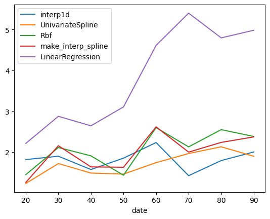
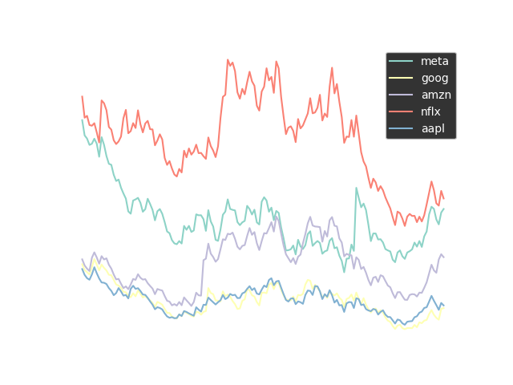
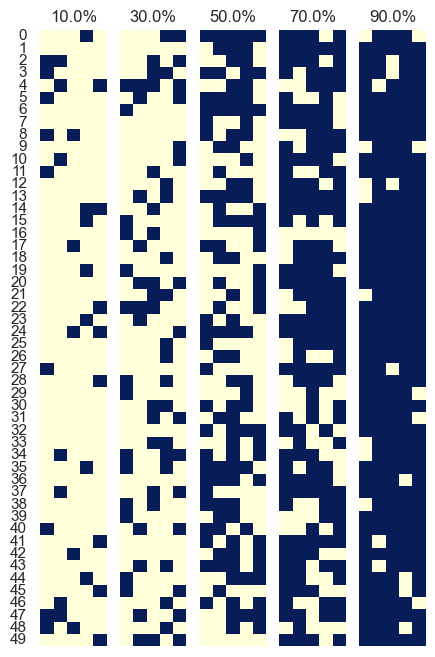
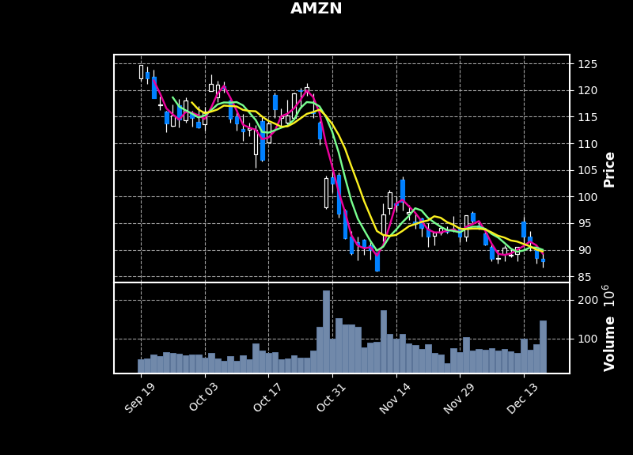
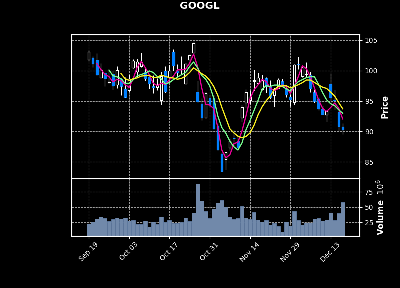
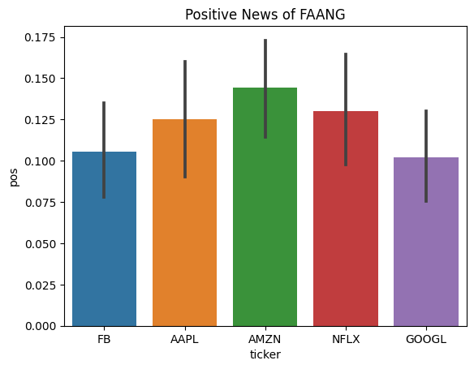
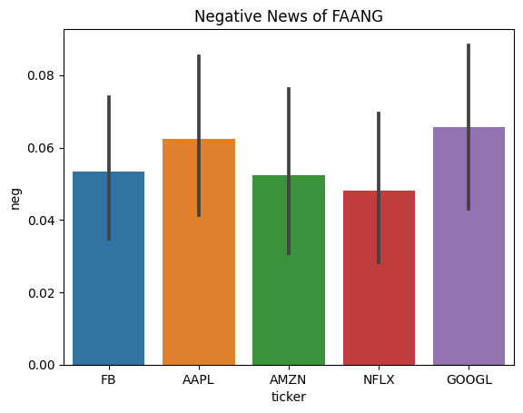
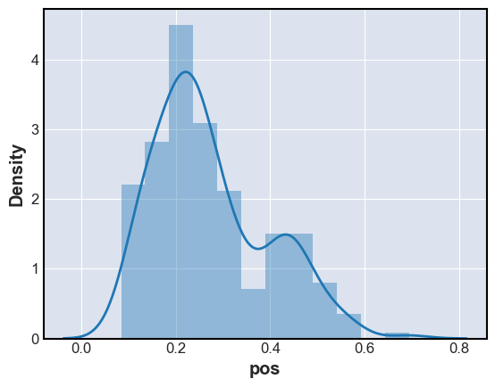

# DataScienceProject

This is a project about my data science course, the main idea is a AI model through fuse the stock news title and past stock price to predict the stock price in the future.

# Visualize Data

## Mask Data
It is important to define an evaluation for various imputation of missing values. We know that the amount of missing data will be $fac = D\cdot p$, which $D$ is the number of days, $p$ is the mask ratio. The error of one stock is

$Loss(stock) = \sum^{D}_{i}{SD_i-SDM_i}$

Thus the Loss function could be:

$\widehat{Loss}=\frac{Loss}{fac} = \frac{\sum^{D}_{i}{SD_i-SDM_i}}{D\cdot p}$

$\widetilde{Loss} = \frac{\widehat{Loss}}{stock_{avg}} =  \frac{\sum^{D}_{i}{SD_i-SDM_i}}{D\cdot p \cdot stock_{avg}}$


### Compared the methods of interpolation methods: interp1d, UnivariateSpline, Rbf, make_interp_spline, and LinearRegression
|        | Loss value in 100 day          | Loss value in 1000 day           |
| ------ | -------------------- | -------------------- |
| Figure |  |  |

### The Risk, Mask values from Day[1000:0] to Day[10:0]
|        | Mask Value          | Risk Value           |
| ------ | -------------------- | -------------------- |
| Figure |  |  |

Finally, the loss of using interp1d to interpolate these stock is fair:

| method   | meta   | goog   | amzn   | nflx   | aapl   |
| -------- | ------ | ------ | ------ | ------ | ------ |
| interp1d | 1.462% | 1.261% | 1.636% | 1.817% | 1.351% |

### Mask ratio, loss and visualization

|        | 2 months stock         | 1.5 years stock           |
| ------ | -------------------- | -------------------- |
| Figure | |  |


## Price

After we draw the price in 2 months and 1.5 years, we found that every stock has a big correlation with others. For example, META(FB) and GOOG(google) in recent 2 months totally have the same rate of ups and downs. It's intuitive, because there are same type of the company. So they face the same marketing problems.Another example is in 1.5 years figure, the would ups and downs in same time.

|        | Mask ratio & Mask loss         | Visualize random mask of different mask ratio           |
| ------ | -------------------- | -------------------- |
| Figure | | 
 |
### FAANG's Candlestick Chart
|        | <center>Figure</center>|
| ------ | -------------------- |
| META|  |
|AMZN||
|AAPL||
|NFLX||
|GOOGL||


## News
### Proportion of data in FAANG News.

### News Amount of Positive or Negative.

### Box Chart of Positive news and Negaitve News of FAANG

|        |<center>Figure</center>|
| ------ | -------------------- |
| Positive News of FAANG|  |
|Negative News of FAANG||
|Neutral News of FAANG||

### Distribution of the good and bad values of the stocks
|        | Negative News distribution    | Postive News distribution   |
| ------ | -------------------- | -------------------- |
| Figure || |


## Correlation Heatmap
|        | 500 days correlation   | 100 days correlation         |
| ------ | -------------------- | -------------------- |
| Figure |  | 
 |
### Correlation Gif
```bash
$python correlation_gif.py
```


# Acknowledgement

This source code is based on FFN, Numpy, Pandas. Thanks for their wonderful works.
